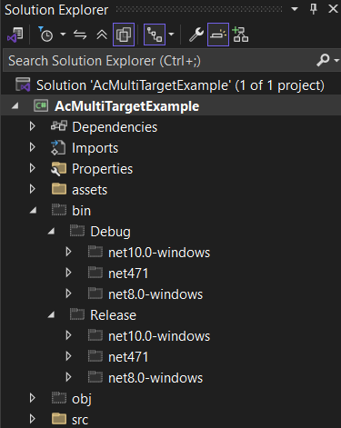
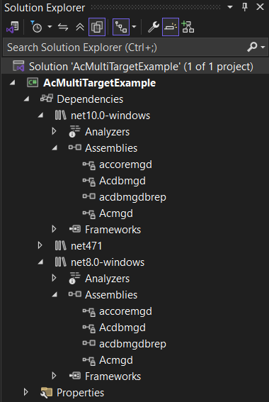
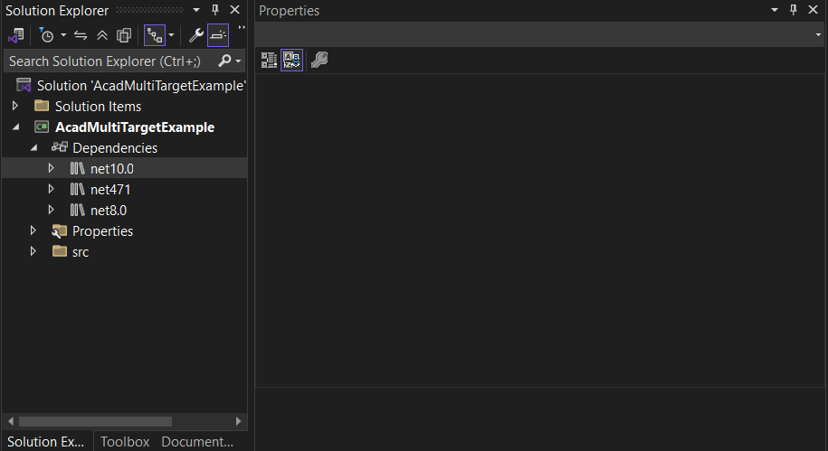
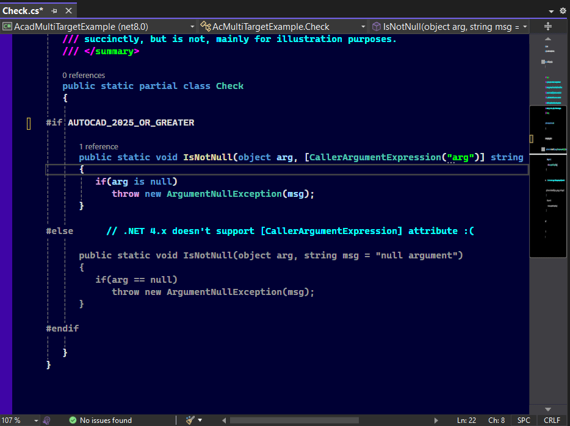
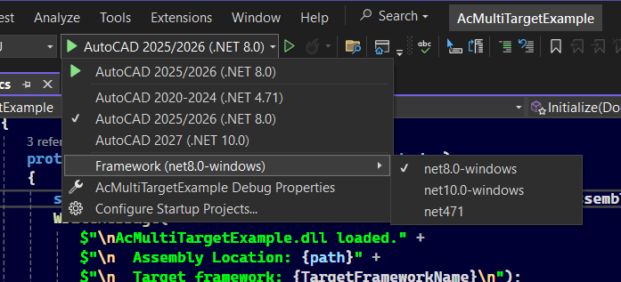

## AcadMultiTargetExample

ActivistInvestor \ Tony T

Distributed under the terms of the MIT License

NOTE: This documentation is in the process of being revised. More updates are pending.

- [Environment Variables](#environment-variables)
- [Multi-targeting Basics](#multi-targeting-basics)
  * [Creating a Project that uses Multi-targeting](#creating-a-project-that-uses-multi-targeting)
  * [Assembly References](#assembly-references)
    + [The Problem](#the-problem)
    + [The Solution](#the-solution)
    + [Nuget Package References](#nuget-package-references)
    + [Project References](#project-references)
  * [Custom Build Logic](#custom-build-logic)
  * [Default AutoCAD References](#default-autocad-references)
    + [Building RealDwg Extensions](#building-realdwg-extensions)
  * [C# Language Issues](#c-language-issues)
    + [Source Code Compatibility](#source-code-compatibility)
    + [Conditional Compilation](#conditional-compilation)
    + [Compiler Constants](#compiler-constants)
    + [Editor Context](#editor-context)
- [Multi-targeting Example Project](#multi-targeting-example-project)
- [Debug Profiles](#debug-profiles)
- [Converting Existing Projects to use Multi-targeting](#converting-existing-projects-to-use-multi-targeting)
- [Diagnostic Console Output](#diagnostic-console-output)

<small><i><a href='http://ecotrust-canada.github.io/markdown-toc/'>Table of contents generated with markdown-toc</a></i></small>

### Notice:

This file and the materials it is included with contain Autodesk-confidential information relating to AutoCAD 2027
that is restricted by NDA. It is not intended for public distribution
or disclosure to anyone that is not bound by the terms of the NDA for
AutoCAD 2027 prior to FCS.

## AcadMultiTargetExample

A *minimal* example project that uses [Multi-targeting](https://learn.microsoft.com/en-us/visualstudio/msbuild/net-sdk-multitargeting) to target 3 different
versions of the .NET framework (.NET Framework 4.71, .NET 8.0, and .NET 10.0),
and 8 AutoCAD product releases that use those frameworks (AutoCAD 2020
through AutoCAD 2027). Also included in the example project is *fully-reusable*
build logic (the `Directory.Build.props` and `Directory.Build.targets` files)
that *vastly-simplify* building AutoCAD extensions that use multi-targeting.

## Environment Variables

In order to build mult-target AutoCAD extensions, the included custom build 
logic *requires* at least two of the environment variables shown below to be 
defined. Each of these environment variables is required *only if you are 
targeting the corresponding framework*. For example, if you don't intend to 
target .NET 4.x in any project, you don't have to define the `AC_NET_4_REF_PATH` 
environment variable, as it will never be used.

For framework versions that you do intend to target, these environment variables 
***are required*** in order for the custom build logic in the included `Directory.Build.*` 
files to work correctly. If these environment variables are not defined, *nothing 
will work*.

You can use the `setx` command to define these environment variables,
or the Environment Variables dialog in Windows.

|Environment Variable|Description|
|-----------------|-------------|
|`AC_NET_4_REF_PATH`|Path to reference assemblies for AutoCAD 2020-2024|
|`AC_NET_8_REF_PATH`|Path to reference assemblies for AutoCAD 2025-2026|
|`AC_NET_10_REF_PATH`|Path to reference assemblies for AutoCAD 2027|

See below for more environment variables that are required to support the included launchSettings.json file.

Note: The paths assigned to the above environment variable 
*should **not** include a trailing slash (\\)*.

Requiring paths to AutoCAD reference assemblies for each target framework 
to be specified using environment variables allows the `Directory.Build.*` 
files to be *fully-portable* across machines where the locations of the 
reference assemblies may differ, thereby supporting widespread distribution 
and team development scenarios.

## Multi-targeting Basics

[Multi-targeting](https://learn.microsoft.com/en-us/visualstudio/msbuild/net-sdk-multitargeting)
provides a means for a single .NET SDK-style project to target multiple
.NET framework versions. When you build a multi-target project, the
project is built *multiple times*, once for each targeted framework,
with the build output for each placed in a different sub-folder below
the \Release and \Debug folders.

<center></center><br>

To use multi-targeting in a C# project, you must use the [`<TargetFrameworks>`](https://learn.microsoft.com/en-us/dotnet/core/project-sdk/msbuild-props#targetframeworks)
element (plural) in your .csproj file, rather than the `<TargetFramework>`
element (singular) (see [this article](https://learn.microsoft.com/en-us/dotnet/standard/frameworks) for an overview).
That page also shows [how to use the `<TargetFrameworks>` element](https://learn.microsoft.com/en-us/dotnet/standard/frameworks#how-to-specify-a-target-framework).

For example, in the .csproj file of a project that uses the *`Directory.Build.props`* and
*`Directory.Build.targets`* files included in this project, you can target
all AutoCAD releases from AutoCAD 2020 thru AutoCAD 2027 (spanning 3 different
framework versions), thusly:
```xml
<Project Sdk="Microsoft.NET.Sdk">
   <PropertyGroup>
      <TargetFrameworks>net471;net8.0-windows;net10.0-windows</TargetFrameworks>
   </PropertyGroup>
</Project>
```
You don't have to target all three frameworks or all AutoCAD releases. For example, you can target only .NET 4.x- and .NET 8.0-based releases of AutoCAD. Or, you can target only .NET 8.0- and .NET 10.0-based releases. For example, to target only AutoCAD 2025 or later, you would use:
```xml
<PropertyGroup>
    <TargetFrameworks>net10.0-windows;net8.0-windows</TargetFrameworks>
</PropertyGroup>
```
Or, to target AutoCAD 2020 through AutoCAD 2026, you would use:
```xml
<PropertyGroup>
    <TargetFrameworks>net8.0-windows;net471</TargetFrameworks>
</PropertyGroup>
```

In the `<TargetFrameworks>` element, The first item in
the list of target framework monikers (TFMs) determines
the *project context*, or which framework Visual Studio
uses for the display of item states in Solution Explorer.

You can change the *project context* framework by
editing the `<TargetFrameworks>` element and rearranging
the order of the TFMs, so that the first element  is the TFM
of the framework used for the project context, however
you should first ensure that the project builds without
error, and there are no unsaved changes in open files.

#### Directly editing a project's .csproj file
In a multi-target project, whenever you directly edit the
project's .csproj file, you should you first *unload* the
project, then open and edit the .csproj file, save your edits,
and then *reload* the project.

### Creating a Project that uses Multi-targeting
Visual Studio 2022 provides no way to create a multi-target project via the
'create a new project' UI. To create a new project that uses multi-targeting,
You first create a standard classlibrary project that targets a single framework
version, and then manually edit the .csproj file and change the `<TargetFramework>`
element to `<TargetFrameworks>` and specify the desired framework versions.

Within the `<TargetFrameworks>` element, each target framework's *Target
Framework Moniker* (TFM) must be specified, delimited by semicolons. You
can find a list of valid TFMs [here](https://learn.microsoft.com/en-us/dotnet/standard/frameworks),
although for AutoCAD development, the set of usable TFMs is limited to the
following:

|Target Framework Moniker|Framework Version|Targeted AutoCAD products|
|------------------|------|-------------------------|
|`net471`|.NET 4.71|AutoCAD 2020-2024|
|`net8.0` or `net8.0-windows`|.NET 8.0|AutoCAD 2025 & 2026|
|`net10.0` or `net10.0-windows`|.NET 10.0|AutoCAD 2027 or later|

The above table shows both *primiary* and *platform-specific* 
TFM's for .NET 8.0 and later. For example, You can use `net8.0` (primary) or
`net8.0-windows` (platform specific) to target .NET 8.0. Using the platform-specific TFM is generally
preferable as it pulls in additional Windows-specific APIs and also disables 
many platform-compatibility warnings, since they are irrelevant in Windows-only
projects such as AutoCAD extensions.

### Assembly References

When multi-targeting is used, different assembly references must be used
for each targeted framework version. In the included example project, under
the Dependencies node in Solution Explorer, you will see child nodes whose
names are the TFM of each targeted framework, and each of those child nodes
will contain assembly references that are specific to that target framework.

<center></center><br>

The following clip shows the example project open in Solution Explorer, with
the Properties palette to its right. Notice that as references from different
target frameworks are selected, the properties palette displays the *effective
path* to the reference, confirming that it is the correct reference path for
the target framework.

<center></center><br>

Using different, framework-specific AutoCAD references is
required when multi-targeting different AutoCAD product releases
that use different framework versions. This poses a problem, and
is the *most-complicated aspect* of building AutoCAD extensions
that use multi-targeting.

#### The Problem
Unfortunately, Visual Studio and its project architecture provides
no way to reference multiple, framework-specific versions of the same
assembly in a multi-target project. That can't be done via the UI,
and further, Visual Studio's project schema provides no formal, 
persistent representation for referencing different, framework-specific
versions of the same assembly. When you right-click on the `Dependencies` 
node (or any framework-specific child node) in a multi-target project and 
choose *Add Project Reference*, You must select an assembly having a specific
path, and Visual Studio adds the assembly reference to the .csproj file,
and emits a `<HintPath/>` element that specifies the absolute path
to the selected assembly. If you do that *builds will fail*, because 
Visual Studio will incorrectly use the *same version of the referenced 
assembly* for *all targeted frameworks*, when different versions of 
that assembly must be used with each target framework.

#### The Solution
The custom build logic in the included `Directory.Build.*` files *transparently*
solves that problem. When that custom build logic is used in a multi-target project,
You can use Visual Studio's UI to add a reference to an AutoCAD assembly to your
project, in the same way you do in a single-target project, and Visual Studio will
*ignore* the path specified in the `<HintPath/>` element, and will instead use the
path specified in one of the [environment variables](#environment-variables) you've
set for each target framework (described below). After you've added references to
AutoCAD assemblies to a multi-target project using the Visual Studio UI, you can open
the .csproj file and remove the `<HintPath/>` elements that Visual Studio generated,
as they will not be used in any case.

You can also add references to AutoCAD assemblies manually by editing the .csproj file.
If you do that, you can safely *omit* `<HintPath/>` *elements* as they *will not be used*,
provided that the required [environment variables](#environment-variables) described above
have been set, and the included `Directory.Build.props` and `Directory.Build.targets` files
are being used by the project.

#### Nuget Package References

You will note that this example project does not use Autodesk-provided Nuget packages for
AutoCAD. There are several reasons for this:

1.  There is no package for AutoCAD releases targeting .NET 4.x.

2.  Autodesk's NuGet packages do not support *nuget package versioning*, that allows a single
package to provide multiple versions of its assemblies, one for each target framework supported
by the library, or one version for each AutoCAD product release. Instead, Autodesk released
separate packages for different AutoCAD releases based on the version of .NET which they target,
and while they can generally be used across product releases that target the same version of .NET,
there can be subtle API revisions across those releases that could result in issues.

4.  AutoCAD releases and the versions of .NET which they target are not fully-aligned, and without
nuget semantic package versioning support, there is no mechanism that allows a package reference to
specify assemblies for a specific AutoCAD product release among several that target the same version
of .NET. For example, neither of the following will work:

```xml
      <PackageReference Include="AutoCAD.NET" Version="25.0.0" />  <!-- 2025 DLLs -->
      <PackageReference Include="AutoCAD.NET" Version="25.1.0" />  <!-- 2026 DLLs -->
```
To support all AutoCAD product releases that target the same version of .NET, a *rule of thumb* is to
always target the ***oldest*** product release for a given .NET framework version. So, for AutoCAD
releases that target .NET 4.x, that would mean compiling against the assemblies for AutoCAD 2020, and
for releases that target .NET 8.0, compiling against the assemblies for AutoCAD 2025.

This example project and the included build logic is designed to support only one AutoCAD product 
release for each targeted .NET version, and it is your decision on what specific AutoCAD product 
release's assemblies should be used. You can specify that by setting the [environment variables](#environment-variables) 
that are used to specify the locations of the AutoCAD assemblies for each targeted framework to 
the appropriate locations holding the assemblies for the AutoCAD product release you want to compile 
against, although it is *strongly recommended* to follow the above rule-of-thumb.

For other third-party nuget packages that support package versioning and multiple target frameworks, there is no difference in how you include them in multi-target projects verses single-target projects. In other words, *It just works*. However, you should keep in mind that if you are going to target all of the AutoCAD releases from 2020-2027 and later, you should ensure that any third-party nuget packages you need to use supports all of the framework versions your project targets.

#### Project References
Project references in multi-target projects work the same way they do in single-target projects with several special requirements.

First, you don't have to specify separate project references for each target framework, but any project references must be to projects that *multi-target at least the same frameworks that are targeted by the referencing project*. In other words, if your project targets .NET 4.x, .NET 8.0, and .NET 10.0, any project references must be to projects that also multi-target those same framework versions.

### Custom Build Logic

The included `Directory.Build.props` and `Directory.Build.targets` files implement themulti-target build logic that is used by all projects in a solution, and all projects that use those files. These files serve to *vastly simplify* building AutoCAD extensions that use multi-targeting to target multiple AutoCAD/NET framework versions. The custom build logic *is not optional*, it is *required* to in order for AutoCAD extension projects that use multi-targeting to build correctly.

`Directory.Build.props` and	`Directory.Build.targets` are designed to be *fully-reusable* and are not coupled to a specific project or solution. You can copy and use them in other multi-target AutoCAD projects as needed, with no changes required. You can have any number of projects share a single `Directory.Build.props` and `Directory.Build.targets` file, by placing them in any folder that contains the projects that are to use them. This *centralized build configuration* strategy allows many projects to use a single custom build configuration, without replicating the custom build logic in each project that uses it.

It is recommended that you add `Directory.Build.props` and	`Directory.Build.targets` to your Solution folder, above any project folders, so that they will be used by all projects in the solution. You can also add them as Solution Items, but that's optional and not required. If you add these files to your solution's folder, you don't have to add them to individual projects in the solution that are contained within the solution's folder, as they are automatically used by all projects within the folder where the files are located.

Before you can use the included `Directory.Build.props` and
`Directory.Build.targets` in a project, you must
assign values to at least two of the three `AC_NET_X_REF_PATH` [environment variables](#environment-variables) described above. The values of these environment variables must point to the locations of AutoCAD reference assemblies for each targeted framework version.

### Default AutoCAD References
The included `Directory.Build.targets` file adds references to the 3 basic AutoCAD assemblies that are used in most AutoCAD managed extensions:

* `AcMgd.dll`
* `AcCoreMgd.dll`
* `AcDbMgd.dll`

Hence, you do not (and should not) add references to those assemblies to any project that uses the included `Directory.Build.targets` file. You can add additional AutoCAD references to Directory.Build.targets that will be used by all projects that use that file, that eliminates the need to add those same references to each project.

#### Building RealDwg Extensions

The custom build logic in the included `Directory.Build.*` files recognize the `<RealDwgExtension>` property, which can be set to `true` in a .csproj file to prevent `AcMgd.dll` from being referenced, which is required in projects where the extension is to be loaded into a *RealDwg host application* such as AutoCAD Core Console:

```xml
<PropertyGroup>
    <RealDwgExtension>true</RealDwgExtension>
</PropertyGroup>
```
### C# Language Issues

If you target .NET 4.x, you can set `<LangVersion>` to at least 8.0 to support compilation of Nullable Reference Types and implicit usings. Or, you can disable both of those features (as is done in this example
project) if you are primarily compiling migrated legacy code that doesn't use those features. If you don't set `<LangVersion>` in a multi-target project, Visual Studio uses the language version officially-supported for each target framework. If you target .NET 4.x and your code uses Nullable Reference Types, Implicit Usings, or other features not supported by the language version for .NET 4.x, you will get compiler errors for the .NET 4.x build.

While you can set `<LangVersion>` to a value that's greater than the officially-supported value for .NET 4.x, you cannot use framework-dependent features (such as `Span<T>`, ranges, etc.) that were introduced in more-recent framework and C# versions, because the language features have a dependence on a more recent framework version. In some cases, packages can be added to projects targeting legacy
framework versions that add various features introduced in later framework versions to them. Examples
include the [System.Memory NuGet package](https://www.nuget.org/packages/system.memory/), which enables the use of `Span<T>` in older framework versions, including .NET 4.x.

#### Source Code Compatibility

Targeting releases of AutoCAD that use .NET 4.x with the same code base
that targets .NET 8.0 or later, can be problematic depending on what
features/functionality the code uses from newer frameworks and language
versions. With Windows Forms components, the issues increase exponentially.

If you can, avoid targeting older AutoCAD product releases that use .NET
4.x and you will be free from the restrictions and limitations on code that
goes with targeting that framework version. The `Directory.Build.targets`
and `Directory.Build.props` files included in this example are designed to
support targeting AutoCAD 2020 or later, but you don't have to target all
releases in multi-target projects that use these files. If you do not
specify .NET 4.x in your project's `<TargetFrameworks>` element, there will
be no build output generated for .NET 4.x, and no references for .net 4.x
needed, and that works without having to modify the `Directory.Build.props` or
`Directory.Build.targets` files. So, you can leave the Directory.Build.* files
as-is, and target only a subset of the frameworks those files support.

#### Conditional Compilation

Targeting multiple framework/AutoCAD versions from a single code base
can introduce another layer of complexity that you may need to deal with,
which is that you may have situations where you want to leverage a feature
that exists in some, but not all of the targeted framework versions.

In those cases, you can use conditional compilation with [compiler-defined preprocessor symbols](https://learn.microsoft.com/en-us/dotnet/standard/frameworks#preprocessor-symbols),
that allow you to conditionally include/exclude code depending on the
targeted framework version/AutoCAD release. The following example shows
the use of one of those preprocessor symbols with `#if/#else/#endif`, to
define two different implementations of a method, one for .NET 4.x, and
the other for .NET 8.0 or later. Note that this example can be expressed
more succinctly, but is not done that way in this case, mainly for illustration
purposes.

```csharp
public static partial class Check
{

#if NET8_0_OR_GREATER

   public static void IsNotNull(object arg, [CallerArgumentExpression("arg")] string msg = "null argument")
   {
      if(arg is null)
         throw new ArgumentNullException(msg).Log(msg);
   }

#else      // .NET 4.x doesn't support [CallerArgumentExpression] attribute :(

   public static void IsNotNull(object arg, string msg = "null argument")
   {
      if(arg == null)
         throw new ArgumentNullException(msg).Log(msg);
   }

#endif

}
```
#### Compiler Constants

The `Directory.Build.props` file included in this project define several
constants that are useful for conditional code compilation. The compiler
constants shown below can be used just like the standard compiler-defined
preprocessor symbols (e.g., `NET_8_OR_GREATER`), and in fact, they are
merely synonyms for same, but help to make the intent clearer.

|Symbol|Condition|
|--------------------------------|------------------------------------|
|`AUTOCAD_2020_OR_GREATER`|Defined when targeting AutoCAD 2020 or later|
|`AUTOCAD_2025_OR_GREATER`|Defined when targeting AutoCAD 2025 or later|
|`AUTOCAD_2027_OR_GREATER`|Defined when targeting AutoCAD 2027 or later|

Example usage (C#):
```csharp
#if AUTOCAD_2025_OR_GREATER

   // code here will be included only when
   // targeting AutoCAD 2025/NET 8.0 or later.

#endif
```		  

#### Editor Context

In a multi-target project, the Visual Studio editor must use one and only
one target framework for the *editor context*. The editor context controls
how intellisense, code completion, error checking, display of code based on
conditional compilation, and various other code-related functions work, based
on the *current target framework*.

For example, the above snippet shows two versions of a method, one used when
targeting .NET 4.x and the other when targeting .NET 8.0 or later. In the
editor, one of these two methods will appear in gray, which indicates it is
not included in the compilation for the current target framework. The *current
target framework* used for the editor context can be selected from the left-most
drop-down control on the navigation bar located just above the editor window.
From this control you can select any targeted framework to use as the editor
context.

In the clip below, the above code example is shown in the editor window, with
conditional compilation using the `NET_8_OR_GREATER` compiler constant, to
control which version of the method is included for .NET 8 or later, and
which is included for .NET 4.X. The clip shows what happens when the current
target framework is changed from the target framework selector dropdown.
Notice that as the current target framework is changed, the display of each
of the two versions of the method are toggled between included and excluded.

<center></center><br>

## Multi-targeting Example Project

The included example project (AcadMultiTargetExample) targets the following framework versions and AutoCAD product releases:

|Target Framework|Target Framework Moniker (TFM)|AutoCAD Product Release(s)|
|------------|-------------|-------------|
|.NET 8.0|`net8.0-windows`|AutoCAD 2025, 2026|
|.NET 10.0|`net10.0-windows`|AutoCAD 2027|


## Debug Profiles

This example project includes a `launchSettings.json` file (in the
Properties folder) that configures the project for debugging in Visual
Studio. The launchSettings.json file defines 3 debugging profiles, one
for each targeted framework/AutoCAD release.

You *must edit this file* and change the paths assigned to the
`workingDirectory` property to point to the locations of the AutoCAD
executable (e.g., acad.exe) to launch, for each launch profile. You
can leave the `executablePath` property as-is, since Visual Studio
will look for `acad.exe` in the working directory and find it. You
should also remove profiles for framework versions that your project
does not target.

You can also add command line arguments to be passed to the executable
as well in the `commandLineArgs` property. The commandLineArgs property
in the example project is defined to pass the `/nologo` switch to start
AutoCAD without showing the splash screen.

When you run the project in the debugger, you can select which launch
profile to use from the dropdown list on the Visual Studio toolbar:
<center></center><br>

## Converting Existing Projects to use Multi-targeting

While it's possible to convert an existing project to use multi-targeting,
it may ultimately be better to start from scratch with a new project and copy the code files from the existing project to the new one, to ensure that the project is correctly-configured for multi-targeting.

If you prefer to convert an existing project, follow the steps below.
These steps should also be followed to create a new project that uses
multi-targeting, after first creating a new classlibrary project
that targets a single framework, and then following these same steps to
configure the new project to use multi-targeting.

When converting an existing project, you should backup the existing project
first. These steps assume that you've already defined the (`AC_NET_x_REF_PATH`)
[environment variables](#environment-variables) that are described above, to point to the AutoCAD
reference assembly locations for each targeted framework.

These steps outline the process of converting an existing (or new project)
that targets a single framework version to one that targets multiple
framework versions:

1. If the project is open in Visual Studio, right-click on the
project node in Solution Explorer, and choose *Unload Project*
from the context menu.

2. Open the project's .csproj file and change the `<TargetFramework>`
element to `<TargetFrameworks>`, and specify the desired target framework
monikers, separated by semicolons. For example, to target AutoCAD 2020
through AutoCAD 2027 you would use:
```xml
   <PropertyGroup>
       <TargetFrameworks>net10.0;net8.0;net471</TargetFrameworks>
   </PropertyGroup>
```

3. Add copies of the `Directory.Build.props` and `Directory.Build.targets`
files from the included example project to the project you are converting to 
multi-targeting. You should copy these files to the solution folder that 
contains the project being converted. You don't have to explicitly add these 
files to the project, as it  will automatically use them if the project is 
located in the same folder or in any subfolder of the solution folder.

4. Add a copy of the `launchSettings.json` file from the included example project 
the Properties folder of the project being converted, and edit it to have
the correct path(s) to the AutoCAD executable(s) and working directories
for each targeted framework/AutoCAD release. You can specify 'acad.exe' as
the executablePath property, and it will be found in the path specified as
the workingDirectory. Note that this step is *optional* and not required for 
multi-targeting to work.

5. Remove any references to `acmgd.dll`, `acdbmgd.dll`, and `accoremgd.dll`
from the .csproj file for the project being converted, as these three references
are included by the `Directory.Build.targets` file. If the project being
converted is designed to not have a dependence on AutoCAD, and is intended
to be loaded into AutoCAD Core Console or another RealDwg host application,
add the following to the .csproj file to suppress referencing  of `AcMgd.dll`:

```xml
   <PropertyGroup>
      <RealDwgExtension>true</RealDwgExtension>
   </PropertyGroup>
```
6. If an existing project includes references to AutoCAD assemblies other
than `AcMgd.dll`, `AcDbMgd.dll`, and `AcCoreMgd.dll`, remove the `<HintPath/>`
child elements from those `<Reference>` elements, as they will not be used.
Note that this step is *optional*.

7. Finally, save all open files, and right-click on the project in Solution
Explorer and choose *Reload Project*, and then build the solution.

After completing the above steps, if Visual Studio displays error messages,
it is most-likely a result of it not being able to fully-reconcile changes
made to the project. In that case, you should save all open files, *close
and restart Visual Studio*, and reopen the solution containing the project.

## Modifying an Existing Multi-target Project

The included example project targets 3 major framework versions and 8
AutoCAD releases that use those framework versions. If you wish
to experiement with or build the example project but don't have 
the AutoCAD reference assemblies for all of the targeted frameworks 
installed, you can remove one of the target frameworks from the 
project (removing two would make it a single-target project). 

If you remove a target framework you also do not need to define 
the corresponding `AC_NET_X_REF_PATH` environment variable.

To modify an existing multi-target project to add, remove, or
change a targeted framework, follow these steps:

1. If the project is open in Visual Studio, right-click on the
project node in Solution Explorer, and choose *Unload Project*
from the context menu.

2. Open the project's .csproj file and edit the `<TargetFrameworks>`
element and add, remove, or replace the desired framework's TFM.

- If you are *only adding* a target framework to the project, you can
skip steps 4 and 5 below, and go to step 6.

4. Right-click on the project node in Solution Explorer and 
choose *Open Folder in File Explorer* from the context menu.

5. In File Explorer, delete the `bin/` and `obj/` folders from the project's root 
folder.

6. Save all open files, and right-click on the project in Solution
Explorer and choose *Reload Project*, and then rebuild the solution.

## Diagnostic Console Output

When a multi-target project is built, for each targeted framework version, a diagnostic message is displayed on the output console indicating the target build and the path to the set of AutoCAD reference assemblies used to build that target. You can view the Output pane to see these messages and use them to verify that build targets are using the correct set of AutoCAD reference assemblies:

```
1>Built target for AutoCAD 2020 / .NET v4.7.1 using references from C:\Program Files\Autodesk\AutoCAD 2023
1>Built target for AutoCAD 2025 / .NET v8.0 using references from C:\Program Files\Autodesk\AutoCAD 2025
1>Built target for AutoCAD 2027 / .NET v10.0 using references from C:\Program Files\Autodesk\AutoCAD 2027
```

Version 2.0 New Functionality and Enhancements

Summary of New Functionality:
	
- Support for startup .dwg, .dwt, and .scr files.

- Implicit and transparent NETLOADing of the debug target into AutoCAD.

- Dynamically-generated command line arguments/switches with 
the option to specify additional, per-project command 
line arguments/switches in .csproj files.
		 
### The *Startup Assets* folder
		 
If a folder named "*Startup Assets*" resides in the root folder of 
the project, it can contain one and only one of each the following 
file types. These files can have any name:
		 
| File type | Description |
|---|---|
| `.dwg` | A drawing file to be opened when AutoCAD starts. Its full path is passed in the dynamically-generated command-line arguments that are used to launch AutoCAD in a debug session.
|
| `.dwt` | A drawing template that if present, is used to create a new drawing when AutoCAD is started. This file *will not be used if a `.dwg` file is also present in the **Startup Assets** folder*. To use a `.dwt` file to create a new drawing, remove any `.dwg` file from the **Startup Assets** folder (or you can just give it a different file extension). 
|
| `.scr` | A script file to be executed when a debug session is started, after the debug target assembly has been loaded. The script file does not have to (*and should not*) NETLOAD the assembly, as that is performed implicitly by a dynamically-generated script file passed as an AutoCAD command-line argument. If a `.scr` file is present in the **Startup Assets** folder, the dynamically-generated loader script will execute that script file immediately after NETLOADing the debug target assembly. |
		 
### Implicit loading of the debug target assembly upon AutoCAD launch:
		 
The included build logic dynamically-generates multiple *loader* script files, one for each target framework, and places them in the build output folders along with each framework-specific output assembly. The script file has the same name as the output assembly. The build logic passes this script file to the AutoCAD command line with the /b switch when a debug session is started.
		 
The dynamically-generated loader script file performs two actions:
		 
1. It NETLOADS the correct, framework-specific debug target assembly. In a multi-target project there are multiple build output assemblies, one for each target framework. The loader script ensures that the correct one is loaded for the debug launch profile that's used.
		 
2. If a script file is present in the *Startup Assets* folder, it executes the script file via the SCRIPT command.
			
This scheme enables script-based loading of the debug target assembly while also allowing a seperate test script to be run upon assembly load, and decouples loading of the debug target from the test script. That allows the test script to contain only test commands, and not have to deal with NETLOADing the debug target assembly explicitly (which is *complicated* in a multi-target project that generates multiple build outputs, one for each target framework). The ultimate objective of this scheme is to allow a single test script to be used with all targeted frameworks/AutoCAD releases.

### Dynamically-generated Command Line

The included build logic looks in the *Startup Assets* folder for the presence of a .dwg/dwt and .scr file, and generates the needed command line arguments to open the .dwg file and/or load the .scr file when AutoCAD is started. In addition, it always adds the /nologo switch. 

To facilitate customization of the dynamically-generated command line, the build logic recognizes the `<AppendToCommandLine>` element that can be added to a project's .csproj file. In this element one can specify additional command line arguments/switches, which are appended to the dynamically-generated command line arguments.

### launchSettings.Json

The included `launchSettings.json` file is almost entirely *property-driven*, and uses both project properties defined by the custom build logic, as well as environment variables that point to the folder containing the debug target executable (usually acad.exe). That allows `launchSetting.json` to be reusable without changes, across multiple projects that use this custom build environment. The included `launchSettings.json` file depends on the following environment variables, which must hold the location of the AutoCAD program executable for each targeted product release.

|Environment Variable|Description|
|-----------------|-------------|
|`AC_NET_4_BASE_PATH`|Path to AutoCAD Installation folder for AutoCAD 2020-2024|
|`AC_NET_8_BASE_PATH`|Path to AutoCAD Installation folder for AutoCAD 2025-2026|
|`AC_NET_10_BASE_PATH`|Path to AutoCAD Installation folder for AutoCAD 2027|


### Customizable Build Parameters

The custom build system recognizes a number of MSBUILD properties that can be optionally defined in a .csproj file, to override/customize the default behavior of the build system:

| Property | Description |
|---|---|
| `<StartupDrawing>` | Can be used to override default probing for a startup drawing in the **Startup Assets** folder, allowing any `.dwg` file to be loaded into AutoCAD at startup, by assigning its full path to this property. |
| `<StartupTemplate>`|<p>Can be used to override default probing for a startup drawing template in the **Startup Assets** folder, allowing any `.dwt` file to be used to create a new drawing at startup, by assigning its full path to this property.</p><p>Note: Use of this property requires that there *not be a startup drawing (dwg) file* either specified explicitly via the `<StartupDrawing>` property, or by the presence of a .dwg file in the *Startup Assets* folder.|
| `<StartupScript>` |<p>Can be used to override default probing for a startup script file in the **Startup Assets** folder, allowing any `.scr` file to be run in AutoCAD at startup, by assigning its full path to this property.</p><p>Note: If this property is assigned to a .scr file, that script file should conform to the same conventions used by a script file in the *Startup Assets* folder. Namely, it should *not* explicitly load the target assembly into AutoCAD, which will already have happened by the time this script file is executed.</p>|
| `<CommandLineArgs>` | Can be used to **completely override dynamic command-line generation**, by assigning the entire command line to be used to start AutoCAD to this property. When this property is assigned, *there is no startup drawing, drawing template, or script file used, and there is no dynamically-generated loader script to load the debug target into AutoCAD*. This property cannot be used in conjunction with the `<AppendToCommandLine>` property. |
| `<AppendToCommandLine>` | Can be used to add additional switches/arguments to the dynamically-generated command line that is used to start AutoCAD in a debug session. This property cannot be used in conjunction with the `<CommandLineArgs>` property. The example below shows the use of the `<AppendToCommandLine>` property to add additional arguments to the implicitly-generated command line. The example specifies that a named view named `PLANVIEW` be restored when the drawing containing it is opened.|

```xml
   <PropertyGroup>
      <AppendToCommandLine>/v PLANVIEW</AppendToCommandLine>
   </PropertyGroup>
```

For issues, questions, and general discussion you can visit the [repository where this project is hosted](https://github.com/ActivistInvestor/AcadMultiTargetExample).

